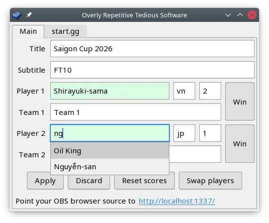
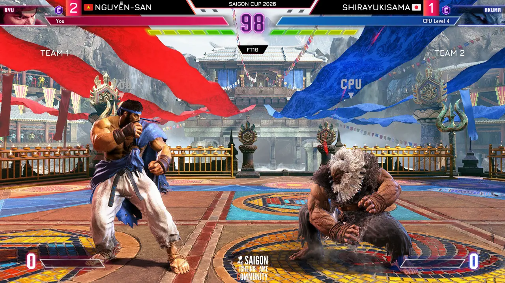

# Overly Repetitive Tedious Software (in Zig)

ZORTS is a simple scoreboard overlay for fighting games. The default design is
compatible with Street Fighter 6, Tekken 8, KOF XV, and Guilty Gear Strive.

> It's also a rehash if [GORTS][1] but this time written
> in Zig using the excellent [dvui][2] instead of the ol' go-plus-tcl Frankenstein.

## Features

ZORTS is heavily inspired by [StreamControl](http://farpnut.net/streamcontrol/)
but has a bunch of opinionated quality-of-life improvements:

- **Visible diff & easy undo**: Changes not yet applied to stream are
  highlighted and can be discarded with the Discard button.

- **Player name + country import**: Player data is saved as a csv file which
  can then be updated manually using any (decent) spreadsheet editor.
  Importing from start.gg will be implemented soon.

- **Flexible player name suggestion as you type**: unlike StreamControl, you
  don't need to care about whitespaces.

- **Cross-platform**: Runs on Windows & Linux. macOS support is unplanned but
  if you really need it, I'm open to contract work.

## Download

You can download from:

- [GitHub](https://github.com/nhanb/zorts/releases/latest): download
  `zorts-windows.zip` or `zorts-linux.zip`.

## Development

Targets zig 0.16. See Makefile for useful commands.

Backlog:

- [ ] start.gg tournament player import
- [ ] use dx11 backend instead of sdl to drastically reduce binary size
      (currently blocked by dx11 backend code [not actually passing hIcon][4] -
      maybe try to fix it?)

## How to use

Just unzip then:

- Run **zorts.exe** (or **zorts** on linux)
- Open OBS => Add browser source => Point to **http://localhost:1337**
- Browser size must be 1920x1080.
- If you want to manually edit the list of player name suggestions, just edit
  **players.csv** with any text editor (notepad++) or spreadsheet editor (excel
  or [libreoffice calc][3])
- If you want to customize the look, open up the **web** folder and go wild.
  You only need basic HTML/CSS/JS knowledge to work on it. No fancy frameworks.

## License

Copyright (C) 2026 Bùi Thành Nhân

This program is free software: you can redistribute it and/or modify it under
the terms of the GNU General Public License version 3 as published by the Free
Software Foundation.

This program is distributed in the hope that it will be useful, but WITHOUT ANY
WARRANTY; without even the implied warranty of MERCHANTABILITY or FITNESS FOR A
PARTICULAR PURPOSE. See the GNU General Public License for more details.

You should have received a copy of the GNU General Public License along with
this program. If not, see https://www.gnu.org/licenses/.

## Credits

### Design

Just like (G)ORTS, the out-of-the-box design in ZORTS was done by
[hismit](https://twitter.com/hismit3rd).

### Icon

ZORTS's icon was lifted verbatim from Haiku OS:
https://github.com/darealshinji/haiku-icons/blob/master/svg/App_MidiPlayer.svg

The following is its original license:

> The MIT License (MIT)
>
> Copyright (c) 2007-2020 Haiku, Inc.
>
> Permission is hereby granted, free of charge, to any person obtaining a copy
> of this software and associated documentation files (the "Software"), to deal
> in the Software without restriction, including without limitation the rights
> to use, copy, modify, merge, publish, distribute, sublicense, and/or sell
> copies of the Software, and to permit persons to whom the Software is
> furnished to do so, subject to the following conditions:
>
> The above copyright notice and this permission notice shall be included in all
> copies or substantial portions of the Software.
>
> THE SOFTWARE IS PROVIDED "AS IS", WITHOUT WARRANTY OF ANY KIND, EXPRESS OR
> IMPLIED, INCLUDING BUT NOT LIMITED TO THE WARRANTIES OF MERCHANTABILITY,
> FITNESS FOR A PARTICULAR PURPOSE AND NONINFRINGEMENT. IN NO EVENT SHALL THE
> AUTHORS OR COPYRIGHT HOLDERS BE LIABLE FOR ANY CLAIM, DAMAGES OR OTHER
> LIABILITY, WHETHER IN AN ACTION OF CONTRACT, TORT OR OTHERWISE, ARISING FROM,
> OUT OF OR IN CONNECTION WITH THE SOFTWARE OR THE USE OR OTHER DEALINGS IN THE
> SOFTWARE.

[1]: https://github.com/nhanb/gorts
[2]: https://github.com/david-vanderson/dvui/
[3]: https://www.libreoffice.org/discover/calc/
[4]: https://github.com/nhanb/dvui/blob/07baf098603b42cad44c2df30c58b01fc0c399d0/src/backends/dx11.zig#L1722
